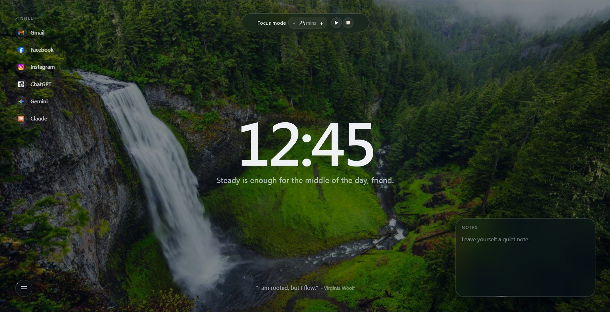

# Minimal New Tab



A minimalist new tab page with a focus timer, pinned sites, quick notes, rotating quotes, and a dynamic background. Everything runs locally—your data stays on your computer.

## Features

- **Focus timer** — set time and go. Gentle sound when the timer expires.
- **Pinned sites** — quick access to your most-used links with automatic favicons.
- **Notes** — jot down quick thoughts that persist as you browse.
- **Greetings & quotes** — time-of-day messages and rotating quotes for inspiration.
- **Dynamic background** — fetches random images (cached locally, no slowdowns).

## Get Started

**Try it now:** https://aruncbhusal.github.io/new-tab

Or set it as your new tab page using one of these methods:

## Option 1: New Tab Redirect Extension (Easiest)

For Chrome, Edge, Brave, and other Chromium browsers:

1. Install [New Tab Redirect](https://chromewebstore.google.com/detail/new-tab-redirect/icpgjfneehieebagbmdbhnlpiopdcmna)
2. Open the extension settings and set the redirect URL to either:
    - `https://aruncbhusal.github.io/new-tab` (use the hosted version), or
    - `file:///FULL/PATH/TO/index.html` (use a local copy)

    For example on Windows: `file:///C:/Users/YourName/Downloads/newtab/index.html`

3. Open a new tab — done.

## Option 2: New Tab Override for Firefox

1. Install [New Tab Override](https://addons.mozilla.org/en-US/firefox/addon/new-tab-override/)
2. In the add-on options, set the New Tab URL to the hosted version or your local file path (same as above)
3. Open a new tab — done.

## Option 3: Unpacked Extension (Chrome/Edge)

If you want to load this as an extension directly:

1. Download or clone this repository
2. Create a `manifest.json` file in the repository folder with this content:

```json
{
    "manifest_version": 3,
    "name": "Minimal New Tab",
    "version": "1.0.0",
    "description": "Minimal new tab replacement",
    "chrome_url_overrides": { "newtab": "index.html" }
}
```

3. In Chrome or Edge, go to `chrome://extensions/` or `edge://extensions/`
4. Turn on **Developer mode** (top right)
5. Click **Load unpacked** and select the repository folder
6. Open a new tab — your new tab page is ready

## Privacy

Everything stays on your computer. Your data lives in browser storage (localStorage) and is never sent anywhere. Background images are fetched from `picsum.photos` and cached locally—you can disable this in your browser's developer tools if you prefer.

## Clear Your Data

If you want to start fresh, run this in your browser's developer console (F12 → Console tab):

```js
localStorage.removeItem('minimal-new-tab-notes');
localStorage.removeItem('minimal-new-tab-nickname');
localStorage.removeItem('minimal-new-tab-links');
localStorage.removeItem('minimal-new-tab-focus-minutes');
localStorage.removeItem('minimal-new-tab-focus-end');
localStorage.removeItem('minimal-new-tab-background-cache');
localStorage.removeItem('minimal-new-tab-hour12');
```

## License

MIT License — see [LICENSE](LICENSE).
